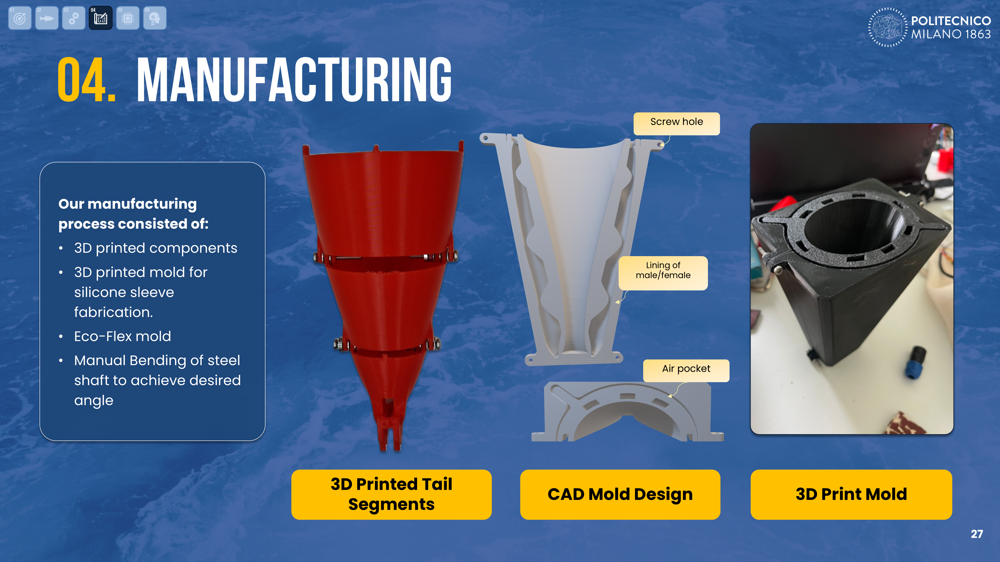
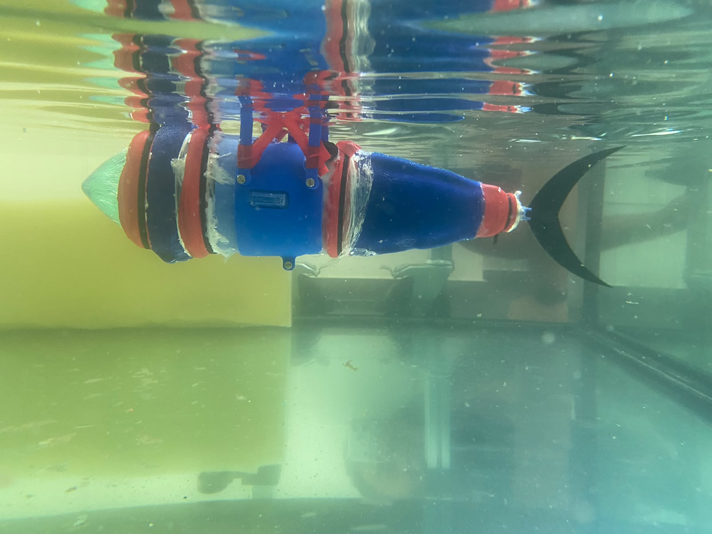
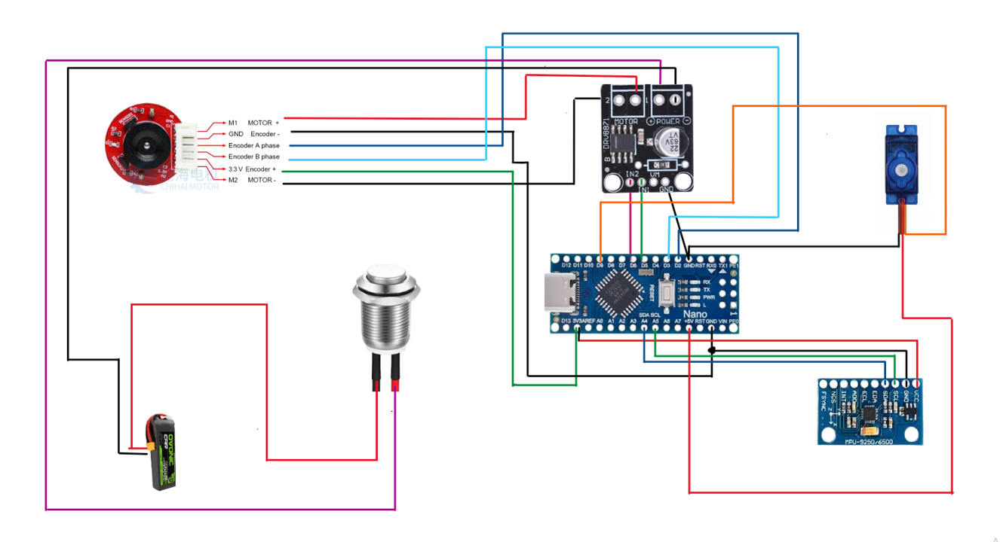
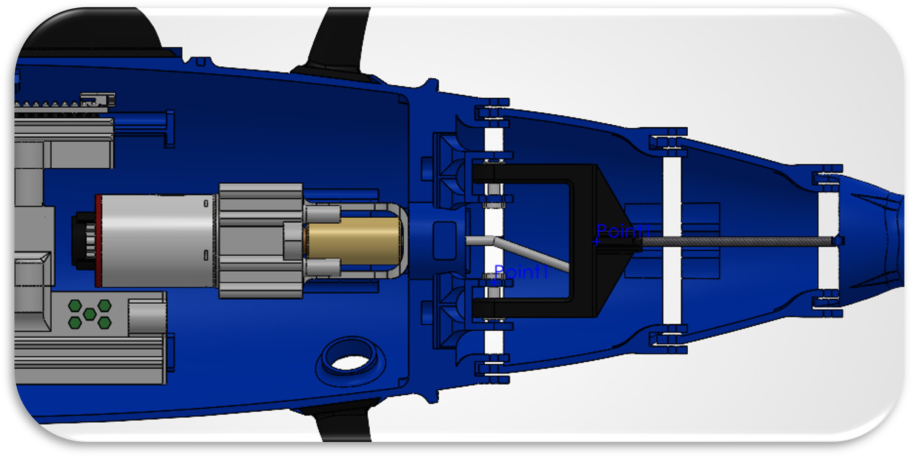
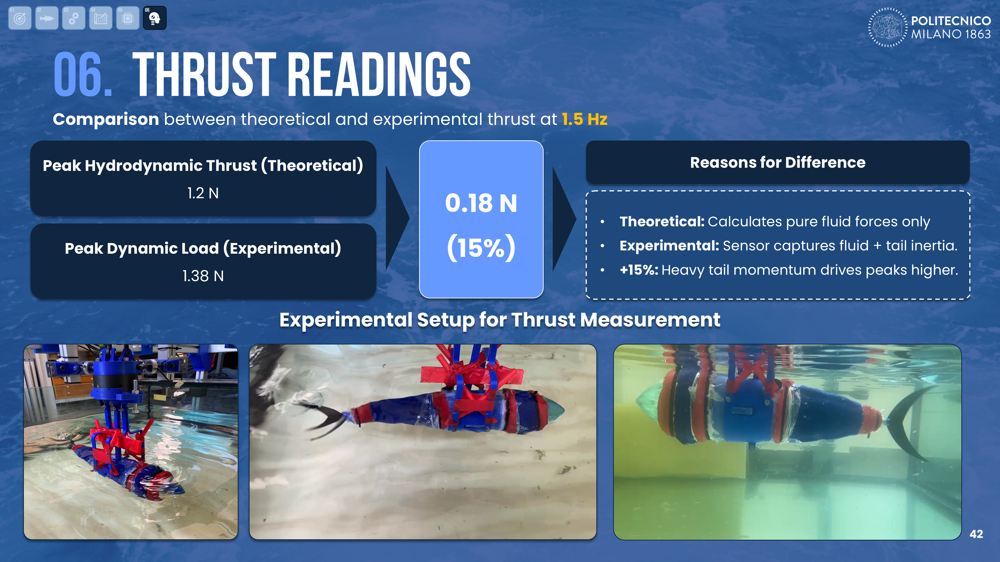
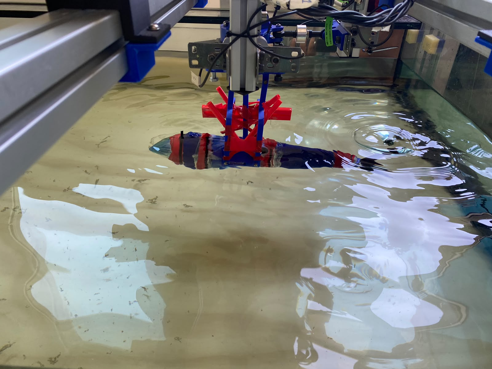

# PHOENIX — Bioinspired Robotic Fish

**Programmable Hybrid Oceanic Entity: Networked Inertial Explorer**

A physically built bioinspired robotic fish based on **Atlantic-mackerel carangiform locomotion**, combining a segmented mechanically actuated tail, waterproof 3D-printed structure, embedded sensing, closed-loop propulsion control, active head stabilization, hydrodynamic modelling, and experimental in-water validation.

> **Status:** Completed academic team project  
> **Team:** Abdelrhman Amgad, Ahmed Mounir, Giulia Di Sipio, Tony Al Helou, Jessica Dichakdjian  
> **Course:** Bioinspired Robotics Lab — Politecnico di Milano  
> **Academic Year:** 2025–2026

---

## At a Glance

| | |
|---|---|
| **Robot type** | Bioinspired robotic fish |
| **Biological inspiration** | Atlantic mackerel |
| **Locomotion** | Body-Caudal Fin (BCF), carangiform |
| **Propulsion** | Single DC motor driving a segmented tail |
| **Steering / stabilization** | Servo-actuated head |
| **Controller** | Arduino Nano |
| **Feedback** | Motor encoder + MPU-9250 IMU |
| **Control** | PID propulsion-speed loop + head stabilization |
| **Manufacturing** | SolidWorks, 3D printing, silicone molding, bent steel shaft |
| **Validation** | Dry tests, waterproofing, buoyancy, thrust measurement, swimming |
| **Final demonstrated speed** | 0.33 m/s at 1.5 Hz |
| **Normalized speed** | 0.73 body lengths/s |

---

# Project Overview

The goal of PHOENIX was to design, manufacture, integrate, and experimentally validate a **waterproof robotic fish capable of sustained straight-line swimming**.

The robot was inspired by Atlantic-mackerel propulsion and simplified into a practical electromechanical architecture suitable for rapid prototyping.

The complete engineering workflow covered:

```text
Biological Locomotion Study
            ↓
Kinematics & Hydrodynamic Modelling
            ↓
Mechanical Architecture
            ↓
CAD & Component Selection
            ↓
Manufacturing & Silicone Fabrication
            ↓
Electronics Integration
            ↓
Embedded Control
            ↓
Waterproofing & Buoyancy
            ↓
Experimental Validation
```

The final prototype successfully generated forward propulsion in water and integrated the mechanical, electronic, sensing, and control subsystems into a functional swimming robot.

---

# My Contributions

This was a **five-person team project**.

My contributions were concentrated in mechanical design, physical fabrication, integration, component selection, and experimental testing.

## Mechanical Design

I worked on the **mechanical design and CAD of the tail system**, including the segmented structure used to reproduce the required oscillatory swimming motion.

I also contributed to development of the propulsion mechanism that converts motor rotation into lateral tail oscillation.

## Manufacturing & Integration

My hands-on work included:

- 3D printing robot components
- mechanical assembly
- silicone molding
- manual bending of the drive shaft
- integration of the tail mechanism
- sealing and waterproofing
- general system integration and troubleshooting

## Electronics & Component Selection

I contributed to selecting and integrating components that had to satisfy two competing requirements:

- fit within the limited internal volume of the fish
- provide sufficient performance for underwater propulsion and sensing

I also assisted with the general electronics integration process.

## Experimental Testing

I participated in the full test programme, including:

- dry mechanical validation
- waterproofing tests
- buoyancy checks
- thrust measurement
- initial swimming trials
- final swimming validation

The embedded software, electronics, and system architecture were developed collaboratively by the team. Code in this repository is therefore presented as **team project code**, not as a claim of sole individual authorship.

---

# Biological Inspiration

PHOENIX was inspired by the **Atlantic mackerel**, selected for its efficient high-speed swimming characteristics.

The robot reproduces a simplified form of **Body-Caudal Fin carangiform locomotion**.

In carangiform swimming:

- most of the body remains relatively rigid
- oscillation is concentrated in the posterior section
- a travelling lateral wave propagates toward the tail
- the caudal fin generates the dominant propulsive force
- passive fins improve stability

---

# Mechanical Architecture

The robot consists of:

```text
Servo-Actuated Head
        ↓
Rigid Main Body
        ↓
Segmented Tail
        ↓
Active Tail Link
        ↓
Rigid Caudal Fin
```

The biological morphology was simplified into a mechanically realizable multi-link system while retaining the essential posterior-body oscillation required for carangiform propulsion.

### Final CAD Assembly

[▶ View final CAD assembly](P.H.O.E.N.I.X_Media/P.H.O.E.N.I.X_CAD/final_cad_assembly.mp4)

---

# Tail Propulsion Mechanism

The propulsion system uses a modified **Scotch-yoke / bent-shaft mechanism**.

```text
DC Motor
   ↓
Bent Shaft
   ↓
Oscillating Flapper / Linkage
   ↓
Segmented Tail Motion
   ↓
Caudal Fin
   ↓
Forward Thrust
```

A single rotating motor input is converted into lateral oscillation.

Mechanical stops and shaft geometry define the permitted angular motion of the tail links.

The architecture provides:

- high tail-beat frequency
- periodic oscillation
- single-actuator propulsion
- mechanically constrained link amplitudes

### Tail Mechanism

[▶ View tail mechanism](P.H.O.E.N.I.X_Media/P.H.O.E.N.I.X_CAD/tail_mechanism.mp4)

---

# Active Head Steering

The head is independently actuated by a servo motor.

Its role is to:

- compensate for heading drift
- improve straight-line stability
- provide active steering authority

The servo command is generated using IMU feedback in the stabilization loop.

---

# Fin Design

The robot includes:

- caudal fin
- dorsal fin
- anal fin
- two lateral fins

The **caudal fin** generates the primary propulsion force.

The remaining fins improve passive roll, yaw, and directional stability.

---

# Materials & Fabrication

The prototype combined rigid and compliant materials.

| Material | Application |
|---|---|
| PLA | External body and fins |
| ABS | Motor supports |
| Low-carbon steel | Bent drive shaft |
| Carbon fiber | Internal spar |
| Brass | Motor coupling |
| Ecoflex 00-10 | Tail and neck silicone sleeves |
| Elastic membrane | Additional waterproofing |

The manufacturing workflow included:

```text
CAD Design
    ↓
3D Printing
    ↓
Silicone Mold Fabrication
    ↓
Ecoflex Casting
    ↓
Steel Shaft Bending
    ↓
Mechanical Assembly
    ↓
Electronics Packaging
    ↓
Waterproofing
```



---

# Waterproofing

Because the robot operates submerged, waterproofing was a major engineering constraint.

The final design used:

- enclosed electronics compartments
- silicone sleeves
- silicone adhesive
- protected shaft and cable interfaces
- iterative leak testing
- sealed mechanical interfaces

### Immersion / Leak Test



---

# Buoyancy

The fish was tuned toward near-neutral buoyancy using:

- internal air volume
- component placement
- body mass
- steel ballast

Buoyancy was validated experimentally before powered swimming.

---

# Electronics Architecture

The embedded system includes:

- Arduino Nano
- brushed DC geared motor
- integrated encoder
- DRV8871 motor driver
- MPU-9250 IMU
- steering servo
- battery
- Hall-effect magnetic input



### Internal Electronics Packaging



Component packaging was a significant design constraint because the electronics had to fit inside the waterproof body while preserving suitable mass distribution and buoyancy.

---

# Software Architecture

The embedded software contains several functional modules:

```text
Mode Manager
      ↓
Propulsion Controller
      ↓
PID Speed Control
      ↓
Motor Driver
      ↓
DC Motor
      ↑
Encoder Feedback


MPU-9250
      ↓
Drift Estimation
      ↓
Head Stabilization
      ↓
Servo Motor
```

The system supports:

- OFF mode
- normal swimming mode
- fast swimming mode
- soft-start ramp
- encoder-based PID speed control
- IMU-based drift estimation
- servo head correction
- magnetic external control

---

# Propulsion Control

Motor speed is regulated using encoder feedback:

```text
Target Frequency
      ↓
Soft-Start Ramp
      ↓
PID Controller
      ↓
PWM Command
      ↓
DRV8871
      ↓
DC Motor
      ↑
Encoder Feedback
```

Primary operating points were approximately:

```text
Normal mode: 1.5 Hz
Fast mode:   3.0 Hz
```

The soft-start stage reduces sudden mechanical loading during startup.

---

# Head Stabilization

The MPU-9250 gyroscope measures body rotation.

```text
Gyroscope
    ↓
Drift Estimate
    ↓
Servo Mapping
    ↓
Head Correction
```

The propulsion loop and the head-stabilization loop operate independently.

---

# Arduino Software

The final integrated robot software is available at:

```text
P.H.O.E.N.I.X_Software/
└── PHOENIX_CODE/
    └── PHOENIX_CODE.ino
```

The repository also preserves intermediate test software:

```text
Software_Used_During_Testing/
├── Calibration_Code/
├── Main_Logic_withPID/
└── Ramp_up/
```

These files document the development process rather than showing only the final result.

The project also contains a separate servo test program:

```text
P.H.O.E.N.I.X_Software/Servo/Servo.ino
```

---

# Kinematics & Hydrodynamic Modelling

The fish was represented using a rigid main body and a segmented multi-link tail.

The modelling work included:

- prescribed joint motion
- tail centerline reconstruction
- equivalent tail geometry
- hydrodynamic force estimation
- thrust prediction
- power estimation
- propulsive efficiency
- actuator sizing

A slender-body / added-mass-based hydrodynamic model was used to approximate the forces generated by the active tail.

The MATLAB model is available at:

```text
P.H.O.E.N.I.X_Software/
└── Dynamics Simulation/
    └── Dynamics_final.m
```

---

# Motor Sizing

The propulsion actuator was sized using:

- predicted hydrodynamic power
- required hydrodynamic torque
- drivetrain/mechanical efficiency
- silicone deformation losses
- safety margin

The final propulsion motor was a:

```text
ChiHai CHR-GM25-370ABHL
12 V brushed DC geared motor
350 RPM
Integrated incremental encoder
```

---

# Experimental Validation

Testing followed a progressive process to avoid exposing the final electronics to water before the mechanical system had been validated.

---

## 1. Dry Motion Test

The first validation stage checked:

- motor-driven tail actuation
- linkage motion through the silicone sleeve
- normal-speed mode
- fast-speed mode
- servo/head movement

[▶ Watch dry motion test](P.H.O.E.N.I.X_Media/P.H.O.E.N.I.X_Testing_Videos/dry_motion_test.mp4)

The expected oscillatory tail motion was achieved before water testing.

---

## 2. Waterproofing & Buoyancy

The robot was then submerged to validate:

- sealing
- sleeve integrity
- electronics isolation
- floating posture
- absence of visible leakage

This stage confirmed that the prototype was ready for powered aquatic testing.

---

## 3. Initial In-Water Trial

The first swimming test was performed without the final stabilizing fins.

[▶ Watch initial water trial](P.H.O.E.N.I.X_Media/P.H.O.E.N.I.X_Testing_Videos/initial_water_trial.mp4)

The robot generated forward propulsion, but directional stability was limited.

Observed roll and yaw motivated the addition of passive stabilizing fins before the final test.

---

# Thrust Measurement

A load-cell test was used to compare theoretical and experimental propulsion.

At **1.5 Hz**:

```text
Theoretical peak hydrodynamic thrust ≈ 1.20 N
Experimental peak dynamic load      ≈ 1.38 N
Difference                          ≈ 15%
```



### Physical Test



[▶ Watch thrust measurement](P.H.O.E.N.I.X_Media/P.H.O.E.N.I.X_Testing_Videos/thrust_measurement_testing.mp4)

The experimental value includes effects that are not fully represented in the simplified theoretical model, including:

- tail inertia
- linkage losses
- turbulence
- structural flexibility
- non-ideal tail motion

---

# Final Swimming Test

The complete robot was tested in water with the final stabilization configuration.

At:

```text
Tail frequency: 1.5 Hz
```

the prototype achieved:

```text
Swimming speed: 0.33 m/s
Normalized speed: 0.73 body lengths/s
```

[▶ Watch full swimming test](P.H.O.E.N.I.X_Media/P.H.O.E.N.I.X_Testing_Videos/full_swimming_test.mp4)

An additional underwater view of the propulsion behaviour is available here:

[▶ Underwater propulsion view](P.H.O.E.N.I.X_Media/P.H.O.E.N.I.X_Testing_Videos/underwater_pov_swimming_thurst_tester.mp4)

---

# Final Course Competition

At the end of the project, the teams participated in a class swimming comparison.

Each group performed a single tank-traversal trial, with performance evaluated using swimming time and body-length normalization.

**PHOENIX recorded the fastest body-length-normalized traversal among the participating group robots in that single-run comparison.**

Because each team performed only one trial, this result is presented as a **course demonstration result**, not as a statistically validated benchmark.

[▶ Watch competition swim](P.H.O.E.N.I.X_Media/competition_final_swim.mp4)

---

# Engineering Iteration

The project archive intentionally preserves earlier design iterations.

The mechanical system evolved through changes related to:

- friction
- tail geometry
- waterproofing
- electronics packaging
- assembly access
- directional stability
- actuator integration

This repository therefore documents not just the final robot, but also the engineering process used to reach it.

---

# Repository Structure

```text
bioinspired-robotic-fish/
│
├── README.md
│
├── P.H.O.E.N.I.X_CAD/
│   ├── P.H.O.E.N.I.X.SLDASM
│   ├── Tail_Links_Assembly.SLDASM
│   ├── Body_V3.SLDPRT
│   ├── Link3.SLDPRT
│   ├── Link4.SLDPRT
│   ├── Link5_V3.SLDPRT
│   └── ...
│
├── P.H.O.E.N.I.X_Software/
│   ├── Dynamics Simulation/
│   │   └── Dynamics_final.m
│   │
│   ├── PHOENIX_CODE/
│   │   └── PHOENIX_CODE.ino
│   │
│   ├── Servo/
│   │   └── Servo.ino
│   │
│   └── Software_Used_During_Testing/
│       ├── Calibration_Code/
│       ├── Main_Logic_withPID/
│       └── Ramp_up/
│
├── P.H.O.E.N.I.X_Media/
│   ├── P.H.O.E.N.I.X_CAD/
│   ├── P.H.O.E.N.I.X_Images/
│   ├── P.H.O.E.N.I.X_Testing_Videos/
│   └── competition_final_swim.mp4
│
└── P.H.O.E.N.I.X_Doc/
    └── Bioinspired Robotics Lab Project Presentation_vf-compressed.pdf
```

---

# Limitations

The prototype achieved the primary project objective, but several limitations remain:

- swimming experiments were performed in a controlled tank environment
- the hydrodynamic model uses simplifying assumptions
- tail-fluid interaction is difficult to represent exactly
- long-duration waterproofing was not characterized
- steering and trajectory tracking remain relatively simple
- full autonomous navigation was outside the project scope
- the final competition comparison used only one trial per team

---

# Future Work

Potential improvements include:

- vision-based navigation
- closed-loop trajectory tracking
- active depth control
- optimized tail geometry
- improved hydrodynamic modelling
- improved waterproofing durability
- reduced drivetrain losses
- energy-efficiency analysis
- longer-duration endurance tests
- autonomous underwater navigation

---

# Skills Demonstrated

This project provides evidence of experience in:

- bioinspired robotics
- underwater robotics
- robotic locomotion
- mechatronics
- SolidWorks
- CAD
- 3D printing
- silicone molding
- waterproof mechanical design
- electromechanical integration
- actuator selection
- Arduino
- embedded systems
- PID control
- encoder feedback
- IMU sensing
- servo control
- MATLAB
- hydrodynamic modelling
- dynamics
- motor sizing
- experimental robotics
- thrust measurement
- iterative prototyping
- system integration
- hardware testing

---

# Team Work & Attribution

PHOENIX was developed as a **five-person academic team project**.

The robot, software, CAD, electronics, and experimental programme were developed collaboratively.

My primary contributions were:

- mechanical CAD and design of the tail system
- development and physical implementation of the propulsion mechanism
- 3D printing
- silicone molding
- shaft bending
- mechanical assembly
- sealing and waterproofing
- electronics/component selection and packaging
- system integration
- experimental testing

Software and system-level code are presented as team project work unless explicitly stated otherwise.

---

# Project Status

✅ **Completed functional underwater robotic prototype**

The final system demonstrated:

- waterproof operation
- stable deployment
- oscillatory tail propulsion
- closed-loop propulsion-speed control
- IMU-based head stabilization
- experimentally measured thrust
- straight-line swimming
- 0.33 m/s swimming speed at 1.5 Hz
- successful final course competition run
